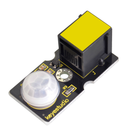
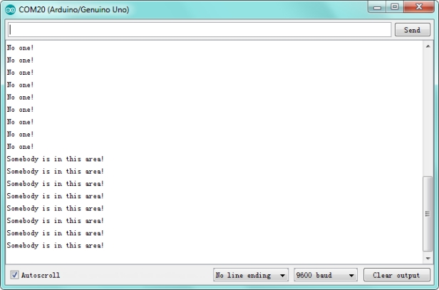

# KS0122 keyestudio EASY plug PIR Motion Sensor



## 1. Introduction

PIR stands for Pyroelectric Infrared (many times, they are also referred as Passive Infrared sensors). This is because their principle of operation is based on the detection of infrared energy emitted by a moving body.

The PIR sensor can detect infrared signals from a moving person or moving animal, outputting switching signals.

One important thing to mention is that when motion is detected, the output will stay high for 2.3 to 3 seconds after the motion stops.

Regarding the power supply, it can work with voltages of both 3.3V and 5V. The device has a detection range of 7 meters and a detection angle of 100º.

This module should be used together with EASY plug control board.

**Special Note:**

The sensor/module is equipped with the RJ11 6P6C interface, compatible with our keyestudio EASY plug Control Board with RJ11 6P6C interface.

If you have the control board of other brands, it is also equipped with the RJ11 6P6C interface but has different internal line sequence, can’t be used compatibly with our sensor/module.

## 2. Specification

- Connector: Easy plug
- Input Voltage: 3.3 ~ 5V, Maximum 6V
- Working Current: 15uA
- Working Temperature: -20 ~ 85℃
- Output Voltage: High 3V, Low 0V
- Output Delay Time (High Level): about 2.3 to 3 Seconds
- Detection angle: 100°
- Detection distance: 7 meters
- Output Indicator LED (When output HIGH, it will be ON)
- Pin limit current: 100mA

## 3. Technical Details

- Dimensions: 38mm * 20mm * 18mm
- Weight: 5.6g

## 4. Connect It Up

Connect the EASY Plug PIR Motion sensor and LED module to control board using RJ11 cables. Then connect the control board to your PC with a USB cable.


## 5. Upload the Code

Download code:  [Code](./Code.7z)

```c
byte sensorPin = 6;
byte indicator = 13;

void setup()
{
    pinMode(sensorPin,INPUT);
    pinMode(indicator,OUTPUT);
    Serial.begin(9600);
}

void loop()
{
    byte state = digitalRead(sensorPin);
    digitalWrite(indicator,state);
    if(state == 1)
    	Serial.println("Somebody is in this area!");
    else if(state == 0)
    	Serial.println("No one!");
    delay(500);
}
```

## 6. Result

Done uploading the code, open the serial monitor and set the baud rate to 9600. If the sensor detects someone moving nearby, you should see the "Somebody is in this area!" is displayed on the monitor. Otherwise, it will display "No one!".

